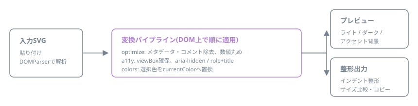

# svg-atelier

[](https://github.com/miruky/svg-atelier/actions/workflows/ci.yml)
[](https://www.typescriptlang.org/)
[](https://vitest.dev/)
[](https://opensource.org/licenses/MIT)

**SVGアイコンを「公開できる品質」に整えるブラウザ内エディタです。最適化、currentColor化、アクセシビリティ属性の付与を貼り付けるだけで行います。**

## 概要

デザインツールから書き出したSVGには、エディタ固有のメタデータ、冗長な小数、固定のwidth/heightが残りがちです。色は決め打ちでテーマに追従せず、aria属性もありません。svg-atelierはSVGを貼り付けると、不要物の除去と数値の丸め、viewBoxの確保、色のcurrentColor化、用途に応じたアクセシビリティ属性の付与を一度に行い、ライト・ダーク・アクセントの3背景でプレビューしながら整形済みコードを返します。

動かす: https://miruky.github.io/svg-atelier/

### なぜ作ったのか

SVGアイコンを使い回せる部品にするには「viewBoxがあり、サイズが可変で、currentColorでテーマに追従し、装飾ならaria-hidden、意味があるならrole+title」という決まり事を毎回守る必要があります。書き出したファイルを手で直すのは退屈で抜けやすい作業なので、貼り付ければ決まり事を満たした状態が出てくるツールにしました。SVGOのような汎用最適化ではなく、アイコンを部品化する際の整形に特化しています。

## 使い方

1. SVGを入力欄に貼る(「サンプルを読み込む」で動作を試せる)
2. 処理オプションを選ぶ(最適化、固定サイズの除去、装飾/意味あり、小数の精度)
3. 色一覧から、テーマに追従させたい色をクリックしてcurrentColor化する(「すべてcurrentColorに」で一括切替も可能)
4. 3背景のプレビューと、16〜48pxのサイズ確認で見え方を確かめる
5. 出力形式(そのままのSVG / CSSの `url()` / Base64 data URI)を選び、コピーするかSVGファイルとしてダウンロードする

入力内容と各オプションはブラウザに保存され、次回そのまま開けます。CSSの `background` に貼るURLエンコード版や、`` に使えるBase64版へワンクリックで切り替えられます。

### 変換の内訳

| 処理               | 内容                                                                                                                                                          |
| :----------------- | :------------------------------------------------------------------------------------------------------------------------------------------------------------ |
| 最適化             | コメント、metadata、inkscape / sodipodi等のエディタ名前空間や `version` / `baseProfile`、未使用の `xmlns:xlink` を除去し、パスの小数を指定桁(既定2桁)に丸める |
| viewBox確保        | viewBoxがなければwidth/heightから補い、固定サイズ属性を外す                                                                                                   |
| currentColor化     | 選択した色をfill / stroke / style属性から探して置換。#333と#333333のような同値表記もまとめる                                                                  |
| 装飾アイコン       | `aria-hidden="true"` を付与し、titleを除去                                                                                                                    |
| 意味のあるアイコン | `role="img"`、`aria-label`、`<title>` を付与                                                                                                                  |

出力欄の下には削減率と除去した不要物の件数を表示します。変換はすべてブラウザ内のDOM操作で行われ、SVGはどこにも送信されません。アニメーションSVGやscript入りSVGの動作は保証しません。

## アーキテクチャ



入力はDOMParserで実際のSVG DOMとして解析し、最適化・アクセシビリティ・色置換の各変換をDOM上で順に適用してから、整形シリアライザで出力します。正規表現でSVGテキストを書き換える方式を採らないのは、属性の順序や引用符の揺れに振り回されず、構造を保ったまま安全に変換するためです。各変換はDOM以外に依存しない純粋なモジュールで、jsdom上のVitestで検証しています。

## 技術スタック

| カテゴリ | 技術                     |
| :------- | :----------------------- |
| 言語     | TypeScript 5(strict)     |
| SVG処理  | DOM API(実行時依存なし)  |
| ビルド   | Vite                     |
| テスト   | Vitest + jsdom(37テスト) |
| リンタ   | ESLint + Prettier        |
| CI / CD  | GitHub Actions           |
| 配信     | GitHub Pages             |

## プロジェクト構成

- `src/lib/parse.ts` — DOMParserによる解析とエラー検出、整形シリアライズ
- `src/lib/optimize.ts` — エディタ由来の不要物除去と数値の丸め
- `src/lib/colors.ts` — 色の集計と正規化、currentColorへの置換
- `src/lib/a11y.ts` — アクセシビリティ属性の付与とviewBoxの確保
- `src/lib/formats.ts` — 出力をCSSの url() やBase64 data URIへ変換する
- `src/app.ts` — 画面の構築、プレビュー、変換パイプラインの結線
- `src/theme.ts` — 配色(自動・ライト・ダーク)の切替
- `docs` — アーキテクチャ図
- `.github/workflows` — CIとGitHub Pagesデプロイ

## はじめ方

### 前提条件

- Node.js 20以上

### セットアップ

```bash
git clone https://github.com/miruky/svg-atelier.git
cd svg-atelier
npm install
npm run dev
```

### テストの実行

```bash
npm test
```

### Lintの実行

```bash
npm run lint
```

### デプロイ

`main` ブランチへのプッシュでGitHub Actionsがビルドし、GitHub Pagesへ自動デプロイします。

## 設計方針

- **DOMとして変換する** — テキスト置換ではなくDOM操作。構造を壊さず、表記揺れに強い
- **描画を変えない最適化だけ** — パス簡略化のような形状を変えうる処理はしない。除去するのは描画に関与しないものに限る
- **テーマ追従を前提にした出力** — currentColor化と固定サイズ除去で、ライト・ダークどちらにも置けるアイコンにする
- **送信ゼロ** — 静的サイトとして配信し、入力をネットワークに流さない

## ライセンス

[MIT](LICENSE)
